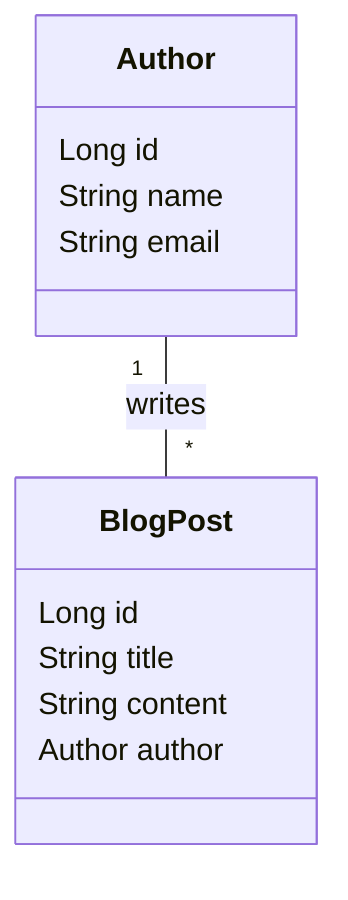

# Entities

```mermaid
classDiagram
    class BlogPost {
        Long id
        String title
        String content
        Author author
    }

    class Author {

        Long id
        String name
        String email
    }

    Author "1" -- "*" BlogPost: writes
```
